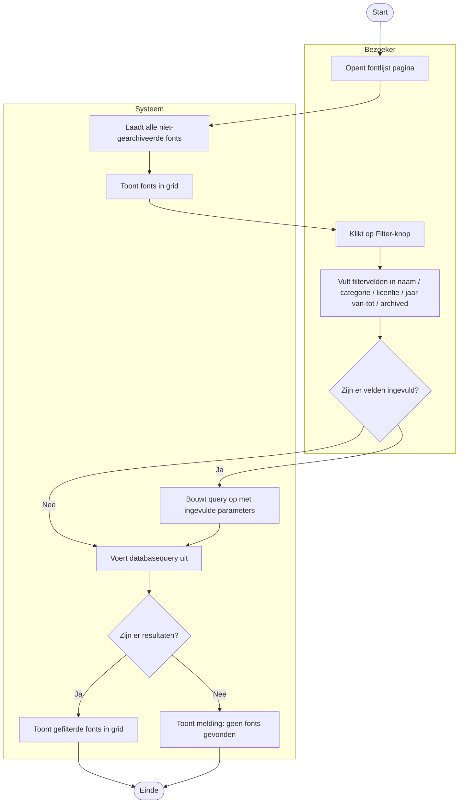

```mermaid
flowchart TB
    subgraph Bezoeker["Bezoeker"]
        A["Opent fontlijst pagina"]
        D["Klikt op Filter-knop"]
        E["Vult filtervelden in naam / categorie / licentie / jaar van-tot / archived"]
        G_CHK{"Zijn er velden ingevuld?"}
    end
    
    subgraph Systeem["Systeem"]
        B["Laadt alle niet-gearchiveerde fonts"]
        C["Toont fonts in grid"]
        F["Bouwt query op met ingevulde parameters"]
        H["Voert databasequery uit"]
        K{"Zijn er resultaten?"}
        I["Toont gefilterde fonts in grid"]
        J["Toont melding: geen fonts gevonden"]
    end
    
    START(["Start"]) --> A
    A --> B
    B --> C
    C --> D
    D --> E
    E --> G_CHK
    G_CHK -- Nee --> H
    G_CHK -- Ja --> F
    F --> H
    H --> K
    K -- Ja --> I
    K -- Nee --> J
    I --> END1(["Einde"])
    J --> END1
```